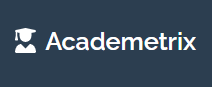

<h1 align="center">Welcome to Academetrix!</h1>

<p align="center">
  
</p>

<p align="center">A Student Result Management System: Web Apllication</p>

---

## 🚀 Project Overview

Academetrix is a powerful web application designed to manage and analyze undergraduate students' marks. It provides a comprehensive set of features to streamline the result management process and empower students and administrators.

## 🌟 Meet the Team

### Group 12 (Project Idea 1)

- Inesha Dissanayake: **E/19/090**
- Manodya Senevirathne: **E/19/366**
- Kalindu Wijerathna: **E/19/446**
- Dhanushka De Silva: **E/18/059**

### Group 07 (Project Idea 2)

- Dinuka Avinash: **E/19/029**
- Anka Peeris: **E/19/275**
- Kavishka Rambukwella: **E/19/309**
- Geethal Wickramasignhe: **E/19/436**

## 📋 Features


1. **User Registration:** Allow undergraduate students to register and create an account in the system.

2. **Course Registration:** Enable batch administrators or student field administrators to register courses, providing course details such as course code, name, credits, and coordinator.

3. **Grade Upload:** Allow administrators to request course coordinators to upload final grades for courses. Course coordinators can upload grades without login/signup or choose to sign up.

4. **Result Editing Restrictions:** Once the coordinator uploads the results, students cannot edit those results further (results in a closed state). Coordinator's results replace any manually entered results by students.

5. **Manual Result Entry:** If the coordinator hasn't uploaded the results, students can enter their total final confirmed marks or grades through the application (results in an open state).

6. **Grade Privacy:** Students can only view their own grades and cannot see others' grades.

7. **GPA Calculation:** Provide a feature for students to calculate their current Grade Point Average (GPA) based on the entered grades.

8. **Expected GPA Calculation:** Allow users to enter their expected GPA, and the system calculates the necessary grades for each semester to achieve the expected GPA in upcoming semesters.

9. **Required Exam Marks Calculation:** When continuous assessment marks are entered, students should be able to calculate the required exam marks needed to achieve an expected grade for a particular course.

10. **Student Rank:** Based on the confirmed marks entered, the system should display the rank of the student within the batch and field.

## Screenshots


*Caption for Screenshot 1.*


*Caption for Screenshot 2.*

## Tech Stack

-  Spring Boot: Backend framework for Java development.
-  Vue.js: Frontend JavaScript framework.
-  MySQL: Relational database management system.
  
## Installation and Usage

### Prerequisites

- Node.js: Ensure that Node.js is installed on your system. You can download it from [here](https://nodejs.org).
- Java Development Kit (JDK): Make sure you have JDK 8 or higher installed on your machine. You can download it from [here](https://www.oracle.com/java/technologies/javase-jdk11-downloads.html).
- Git: Install Git version control system from [here](https://git-scm.com/downloads).

### Clone the Repository

1. Open your terminal or command prompt.
2. Change the current working directory to the location where you want to clone the repository.
3. Execute the following command to clone the repository:

   ```
   git clone https://github.com/cepdnaclk/e19-co225-student-results-management-system-webapp.git
   ```

### Frontend (Vue.js) Setup

1. Navigate to the frontend directory:

   ```
   cd e19-co225-student-results-management-system-webapp/frontend
   ```

2. Install the dependencies using npm:

   ```
   npm install
   ```

3. Start the Vue.js development server:

   ```
   npm run serve
   ```

   The application will be accessible at `http://localhost:8080`.

### Backend (Java Spring Boot) Setup

1. Open another terminal or command prompt.
2. Navigate to the backend directory:

   ```
   cd e19-co225-student-results-management-system-webapp/backend
   ```

3. Build the Java Spring Boot application using Maven:

   ```
   ./mvnw clean package
   ```

4. Start the Spring Boot application:

   ```
   ./mvnw spring-boot:run
   ```

   The backend server will be running at `http://localhost:8081`.

### Access the Application

1. Open your web browser.
2. Enter `http://localhost:8080` in the address bar.
3. You should now be able to see and interact with the application.

### Shutting Down the Application

To stop the Vue.js development server or the Spring Boot backend, simply press `Ctrl + C` in the respective terminal or command prompt windows.

## 📞 Contact Us

If you have any questions, suggestions, or need assistance with Academetrix, feel free to reach out to any member of our team!
- Email: [e18059@eng.pdn.ac.lk]
         [e19029@eng.pdn.ac.lk]
         [e19090@eng.pdn.ac.lk]
         [e19275@eng.pdn.ac.lk]
         [e19309@eng.pdn.ac.lk]
         [e19366@eng.pdn.ac.lk]
         [e19436@eng.pdn.ac.lk]
         [e19446@eng.pdn.ac.lk]

We appreciate your support and look forward to hearing from you. Have a great day! :smiley:
